把第八章的形成一个函数库，用python

第十一章是辐射源目标识别的系统设计和管理，在做的时候可以看看

物理含义、仿真、看前几章内容

### 预处理模块

在不存在或不了解标准信号规格(如不存在同步码)的情况下，基于已有的信号样本实现这些样本的起始时间、中心频率和初始相位的一致化。

- 在训练模式下，将所有辐射源样本作为一个集合实现集合内样本的时频相对齐。

- 在识别模式下，需引入训练模式下已对齐且信噪比最高的样本作为标准样本进行对齐。

考虑已知多个信号样本由同一个辐射源产生的情况。此种情况下可累积多个辐射源样本来完成辐射源识别，其正确识别率将大于单样本识别的正确识别率。这相当于提取多个辐射源样本中能反映辐射源本质特性的“公共波形”，消除噪声和其他随机因素带来的影响，此“公共波形”即可替代原始的辐射源样本以完成识别。

不同样本的中心频率和初始相位存在差异，因此简单地平均并不能达到较好的效果。一种直观的方法是，对此信号样本进行前述的频率和相位对齐以后，再进行平均得到“公共波形”，但由于各样本的信噪比可能存在差异，这种平均方法仍然不能取得较好的效果。借鉴 Lenden 等提出来的**迭代加权最小二乘算法**来完成“公共波形”的提取。

#### 基于样本互相关的时间、频率和相位对齐

1. **函数参数**：

   - `samples`: 输入信号样本列表，每个元素是N×1的numpy数组
   - `snr_order`: 布尔值，控制是否按信噪比重排样本

2. **实现步骤**：

   - 对每个新样本(k=1到M-1)：

     - 计算与前面所有已对齐样本(j=0到k-1)的互相关并累加
     - 找到使累计互相关最大的时延
     - 对该样本进行相应点数的循环移位

   - 设置CZT参数，在[-π, π]范围内搜索频率

   - 对每个新样本(k=1到M-1)：

     - 计算与前面所有已对齐样本(j=0到k-1)的乘积`z_j*(n)z_k(n)`

     - 对乘积序列进行CZT变换得到频谱
     - 累加所有频谱的幅值平方
     - 找到使累计功率谱最大的频率
     - 应用相位校正`e^{-j*ω*n}`

   - 对每个新样本(k=1到M-1)：

     - 计算与前面所有已对齐样本(j=0到k-1)的互相关值`c_j(n) = z_j*(n)z_k(n)`
     - 累加所有j和n的互相关值（n从1到N-1）
     - 计算累加和的相位作为最佳相位偏移
     - 应用相位校正`e^{-j*φ}`

3. **备注**：

   - 信噪比估计采用信号的方差与残差方差的比值
   - 频率搜索范围覆盖[-π, π]以检测所有可能的频偏
   - CZT点数设为信号长度的2倍以获得更好的频率分辨率
   - 相位校正是对所有采样点应用相同的相位旋转

```python
def align_time(samples: List[np.ndarray], snr_order: bool = True) -> List[np.ndarray]:
    """
    基于互相关的时间对齐
    :param samples: 信号样本列表，每个为N×1向量
    :param snr_order: 是否按信噪比从大到小重排
    :return: 时间对齐后的样本列表
    """
def align_frequency(samples: List[np.ndarray], snr_order: bool = True) -> List[np.ndarray]:
    """
    基于互相关的频率对齐
    :param samples: 时间对齐后的样本
    :param snr_order: 是否按信噪比重排
    :return: 频率对齐后的样本
    """
def align_phase(samples: List[np.ndarray], snr_order: bool = True) -> List[np.ndarray]:
    """
    基于互相关的相位对齐
    :param samples: 频率对齐后的样本
    :param snr_order: 是否按信噪比重排
    :return: 相位对齐后的样本
    """
```

#### 多样本“公共波形”提取方法

1. **函数参数**：

   - `samples`: 同源信号样本列表，每个为N×1的numpy数组
   - `beta`: 收敛阈值，默认为0.001
   - `kappa`: 权值门限，默认为1.345

2. **算法实现步骤**：

   - 初始化权值、公共波形、幅度和频率偏移估计
   - 迭代执行以下步骤直到收敛：
     - 更新公共波形μ（使用加权最小二乘）
     - 更新每个样本的幅度A_k
     - 根据重建误差更新权值
     - 计算损失函数并检查收敛条件

3. **备注**：

   - **频率偏移矩阵Ω(v_k)**：根据公式(8.2)构建对角矩阵，对角元为exp(-jnω)

     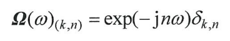

   - **权值函数h(x)**：根据公式(8.4)实现，使用Huber-like权值函数

     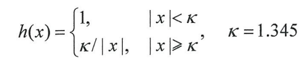

   - **收敛判断**：比较相邻两次迭代的损失函数比值

```python
def extract_common_waveform(samples: List[np.ndarray], beta: float = 0.001, kappa: float = 1.345) -> np.ndarray:
    """
    提取同源样本的公共波形
    :param samples: 同源信号样本列表
    :param beta: 收敛阈值
    :param kappa: 权值门限
    :return: 公共波形向量
    """
```

### 特征降维模块

基于机器学习的特征提取是在建立某种表述特征描述能力的目标函数后，寻找**使目标函数最大化**的数学映射，再将该映射作用到原始数据上得到特征。这种特征提取从形式上来看可理解为降维。基于机器学习的特征提取通常包含训练阶段，即机器从已知类属的样本中学习，从而获取特征提取映射。训练完成后，应用该映射对未知类属的样本进行特征提取和识别。

在机器学习领域，常用的降维特征提取方法包括PCA和独立成分分析ICA、LDA等方法，本节介绍MMI和LDA、SDA。

#### MMI特征提取（AR算法）-互信息最大化

MMI方法的基本思想如图8.3所示，即通过寻找参数矩阵W对辐射源信号x做数学变换g(x,W)，得到低维特征向量y，使得发射机标签与y 的互信息I(c, y)最大，从而获取具备信息论意义上最优的特征映射和特征向量。此算法复杂度较高。

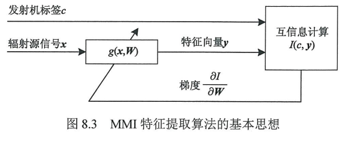

经过研究人员优化，现多采用一种基于互信息最大化的监督线性特征提取方法，AR算法（Artes-Rodriguez method）。

``` python
def mmi_feature_extraction(X: np.ndarray, labels: np.ndarray, n_components: int, 
                          max_iter: int = 100, learning_rate: float = 0.01, 
                          tol: float = 1e-6) -> np.ndarray:
    """
    MMI（互信息最大化）线性特征提取（AR算法）
    :param X: 输入样本矩阵 (n_samples, n_features)
    :param labels: 样本标签
    :param n_components: 输出特征维数
    :param max_iter: 最大迭代次数
    :param learning_rate: 学习率
    :param tol: 收敛容限
    :return: 特征提取矩阵 W (n_components, n_features)
    """
```

1. **函数参数**：

   - `X`: 输入样本矩阵 (n_samples, n_features)
   - `labels`: 样本标签
   - `n_components`: 输出特征维数
   - `max_iter`: 最大迭代次数
   - `learning_rate`: 学习率
   - `tol`: 收敛容限

2. **算法实现步骤**：

   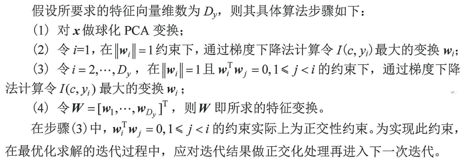

   - 球化PCA变换，消除原始特征间的关联
   - 类别先验计算，预分类样本便于后续计算
   - 第一个特征分量提取，仅施加单位范数约束 $|w_1| = 1$，通过梯度下降计算使$I(c, y_1)$最大的变换$w_i$（特征向量）
   - 后续特征分量提取，施加双重约束：$|w_i| = 1$ 且 $w_i^T w_j = 0, 1 \leq j < i$。通过梯度下降计算使$I(c, y_1)$最大的变换$w_i$。每次迭代后均进行正交化处理
   - 组合所有特征向量得到变换矩阵W

3. **关键细节**：

   - 最大化特征与标签的互信息

     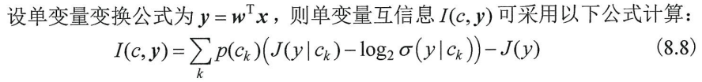

   - 使用负熵作为非高斯性的度量

   - **负熵估计**：根据公式(8.9)实现Hyvarinen负熵估计器

     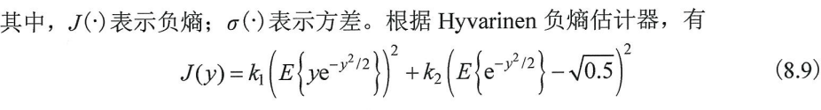

   - **梯度计算**：根据公式(8.10)和(8.11)实现MMI梯度

     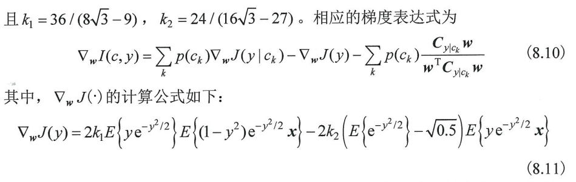

   - **正交约束**：确保输出特征分量不相关

   - **PCA预处理**：减小误差项影响

#### LDA特征提取

尽管 MMI方法所提取的特征具备信息论意义上的最优区分能力，但这种最优性往往需要**足够多的样本**才能够体现出来。当样本较少或维数较高时，互信息计算将存在较大的误差，从而导致所提取的特征不再具备最优性。另外，由于MMI方法需要做多次迭代运算才能得到最优解，且每次迭代都需要进行复杂的矩阵运算，因此如果样本充分，MMI方法对计算时间和存储空间的要求又变得非常高。尽管 AR 方法在很大程度上缓解了这一问题，但其**复杂度仍然较高**。鉴于此，应寻求更为简单，但在一定条件下又等价于MMI方法的机器学习特征提取方法。

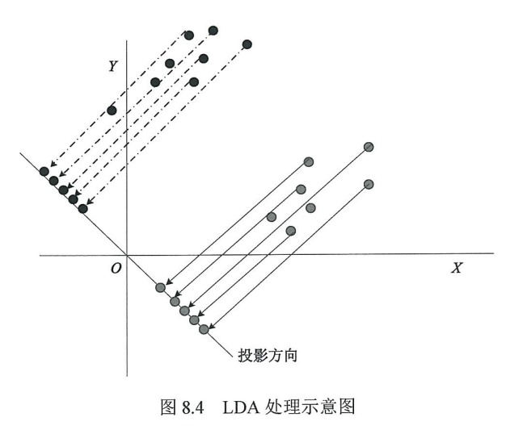

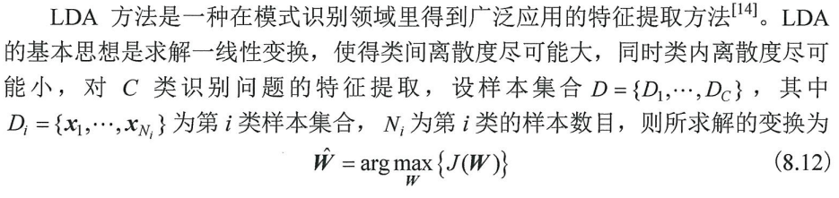

``` python
def lda_feature_extraction(X: np.ndarray, labels: np.ndarray, n_components: Optional[int] = None) -> np.ndarray:
    """
    LDA线性鉴别分析特征提取
    :param X: 输入样本矩阵 (n_samples, n_features)
    :param labels: 样本标签 (n_samples,)
    :param n_components: 输出特征维数（≤ C-1），默认为C-1
    :return: 特征提取矩阵 W (n_components, n_features)
    """
```

1. **算法实现步骤**：

   - 构建类内散布矩阵 $S_w$

   - 构建类间散布矩阵 $S_b$

   - 求解广义特征值问题：

     求解 $S_b w = \lambda S_w w$，取前`n_components`个最大特征值对应的特征向量

     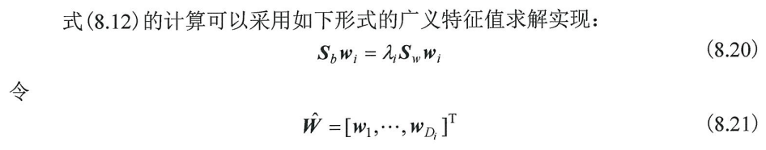

2. **备注**：

   - 最大化类间离散度与类内离散度的比值
   - 基于Fisher准则的最优线性判别（类内散布最小化、类间散布最大化）
   - 计算效率高

#### SDA特征提取

LDA方法只能提取得到不多于 C-1维的特征，且仅在高斯最优模型下具备贝叶斯最优性。为了扩展LDA 的数据适应性，提出了子类鉴别分析(subclass discriminant analysis，SDA)方法。

SDA 的基本思想：将每类的原始数据做进一步划分，构造一组子类数据集，这种子类划分把不满足高斯分布的大类变成了多个近似服从高斯分布的子类，在此基础上再采用 LDA 方法完成特征提取。

``` python
def sda_feature_extraction(X: np.ndarray, labels: np.ndarray, H_max: int = 10) -> Tuple[np.ndarray, dict]:
    """
    SDA子类鉴别分析特征提取
    :param X: 输入样本矩阵 (n_samples, n_features)
    :param labels: 样本标签 (n_samples,)
    :param H_max: 最大子类数搜索范围
    :return: 特征提取矩阵 W，子类划分信息
    """
```

1. **算法实现步骤**：

   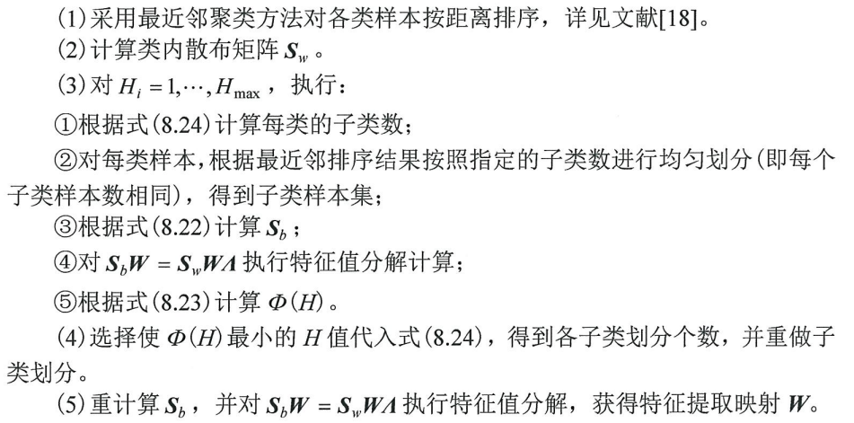

   - 最近邻聚类排序，对每个类别的样本进行最近邻排序，建立样本间的邻接关系

   - 计算类内散布矩阵 $S_w$

   - 搜索最优子类数

     对 $H = 1$ 到 $H_{max}$ 循环：

     - 根据公式(8.24)计算每个类别的子类数 $H_i$，fix()为向下取整

       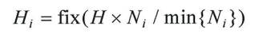

     - 按最近邻排序结果均匀划分子类

     - 根据公式(8.22)计算类间散布矩阵 $S_b$

       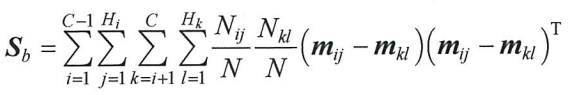

     - 求解广义特征值问题 $S_b W = S_w W \Lambda$

     - 根据公式(8.23)计算 $\Phi(H)$

       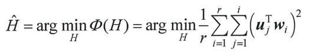

   - 选择最优H：选择使 $\Phi(H)$ 最小的 $H$ 值。然后根据公式(8.24)重新计算每个类别的子类数，重新子类划分。

   - 使用最优H重新计算 $S_b$，再次求解广义特征值问题 $S_b W = S_w W \Lambda$

   - 取前 $C-1$ 个特征向量构建特征提取矩阵 $W$

2. **备注**：

   - 自适应选择：通过搜索自动确定最优子类数，保证每个子类都有足够样本，解决样本不平衡问题
   - 最近邻排序：保证同类样本按相似度排序
   - 扩展LDA到更复杂的分布情况

#### SDA改进方法

SDA算法主要缺陷有两个：

1. 采用的简单最近邻聚类方法聚类效果差，**难以适应复杂的高维数据模型**。
2. **类内散布矩阵计算不合理**，未针对子类划分进行修正。

为弥补上述缺陷，本节提出一种更适用于辐射源特征多中心分布情况的特征降维方法。

改进缺陷1可以有两种方式：①选择适合高维复杂数据模型的聚类方法来克服简单最近邻聚类方法的缺陷，②在聚类前首先对特征进行选择，选择特征分布明显分裂成多中心的特征集进行低维聚类。本节采用后一种方法，即根据特征分裂情况对每一维度进行打分，特征分裂明显的维度得分较高，**筛选出高分裂维度的数据**做聚类处理。

缺陷2是造成 SDA方法在应对多中心分布特征降维问题时性能下降的根本原因。SDA 方法通过将不符合高斯分布的大类划分为多个近似符合高斯分布的子类来实现对非高斯分布的数据类型的适应，但该方法只修改了类间散布矩阵的计算，对于类内散布矩阵仍沿用LDA方法。但更合理的方式是**按照子类划分重新计算类内散布矩阵**，即式(8.25)：

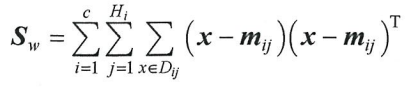

``` python
def sda_improved(X: np.ndarray, labels: np.ndarray, H_max: int = 10) -> np.ndarray:
    """
    SDA改进方法：子类划分 + 修正类内散布矩阵
    :param X: 输入样本矩阵 (n_samples, n_features)
    :param labels: 样本标签 (n_samples,)
    :param H_max: 最大子类数
    :return: 特征提取矩阵 W (n_components, n_features)
    """
```

1. **算法实现步骤**：

   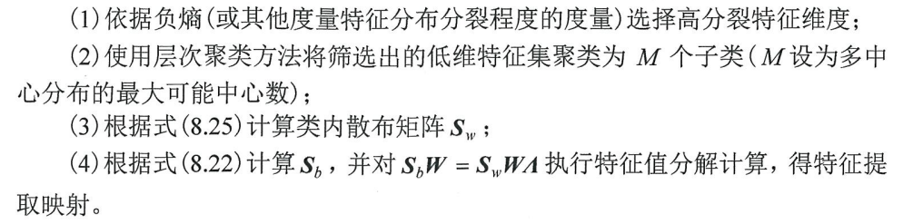

   - 计算每个特征的负熵（使用峰度作为近似），选择负熵较大的特征（即分裂程度高的特征）
   - 层次聚类划分子类（ward连接方式的凝聚聚类）
   - 计算修正的类内散布矩阵
   - 计算类间散布矩阵
   - 特征值分解获取映射，求解广义特征值问题 $S_b W = S_w W \Lambda$，取前 $C-1$ 个特征向量构建特征提取矩阵

2. **备注**：

   - 无需预设子类数：通过聚类自动确定
   - 特征选择：使用负熵筛选重要特征维度

### 基于机器学习的辐射源特征提取

引入预处理、MMI和鉴别分析方法（如LDA、SDA）等综合完成辐射源特征提取。

#### 基于固定调制信号的机器学习特征提取

利用通信信号中的前导码或电子脉冲中的固定调制部分（这部分信号在不同设备间内容是相同的），结合 MMI(AR) 等算法进行特征提取，可以排除通信内容带来的干扰，从而更好地提取出反映设备硬件差异的细微特征，实现辐射源个体识别。

本节将 MMI(AR)方法、LDA方法和 SDA方法作用于固定调制信号，从而实现从模采信号样本中直接进行特征提取，以提高特征区分能力。

**算法实现步骤**：

1. 信号预处理

   - 提取包含暂态的前导信号段或电子脉冲信号。

   - 将信号从中频变换到基带（复信号形式）。

   - 完成各种时间同步和对齐，确保后续处理的一致性。

2. 数据重构

   - 由于变频后得到的是复信号（不利于直接处理），需要进行转换：

     将基带复信号$r_b$的实部（I路）和虚部（Q路）拼接起来，形成一个实向量样本：

     $x=[Re[r_b]; Im[r_b]]$

   - 这种拼接方式保留了原始波形的全部细节信息，是无损的。

3. 特征提取与识别

   - 使用重构后的信号样本，采用 MMI(AR)方法、LDA方法 或 SDA方法 进行训练，构建特征提取映射。
   - 对未知样本应用训练好的映射提取特征，最后送入分类器完成辐射源识别。

#### 基于星座误差的机器学习特征提取

对于通信信号而言，基于固定调制信号的机器学习特征提取局限于信号前导段。一方面，前导信号段长度有限，使得其所能包含的辐射源畸变特性的内容有限，也更易受噪声影响;另一方面，如果前导信号不存在，则无法有效提取辐射源指纹特征。为此，应考虑从随机信息符号调制信号段提取特征，但此时随机的符号调制就成为一个干扰因素。

为了解决随机符号调制带来的问题，采用解调反馈的方法来消除其调制的影响。解调星座与标准星座的误差能够反映辐射源的畸变特性。由于误差信号已不包含调制符号的影响,可以采用机器学习特征提取方法从中提取指纹特征。

**算法实现步骤**：

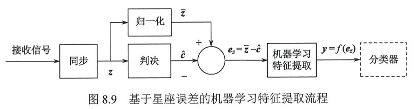

1. 信号预处理与同步

   - 完成时间同步、频率同步和相位同步。
   - 经过同步后，得到星座点 z。这是信号在星座图上的实际位置。

2. 判决与重构标准星座点

   - 根据该信号使用的调制方式，对 z进行硬判决。
   - 判决得到的结果是 $\hat{c}$，即离 z最近的标准星座点（理论上的理想位置）。

3. 幅度归一化

   - 根据信号幅度的估计结果，对星座点 z 进行幅度归一化处理。
   - 得到归一化星座点$\bar{z}$，使其幅度与标准星座点 $\hat{c}$的幅度相对应，消除信号传播带来的幅度缩放影响。

4. 计算星座误差

   - 计算归一化星座点与标准星座点之间的误差向量：

     $e_z=\bar{z}-\hat{c}$

   - 这个$e_z$反映了由于发射源硬件瑕疵（如功放非线性、I/Q 不平衡等）导致的信号畸变，这正是区分不同辐射源的关键信息。

5. 机器学习特征提取与分类识别

   - 将误差向量 $e_z$ 作为输入数据。
   - 采用机器学习方法（如 MMI、LDA、SDA 等）对 $e_z$ 进行特征提取。
   - 得到最终的特征向量 $y=f(e_z)$。
   - 将提取到的特征 y 送入分类器，完成对辐射源个体的识别。

### 基于机器学习的特征变换和选择

特征降维是指通过某种映射将样本从**高维空间映射到低维空间**，其目的是：利用降维特征进行识别或分选，应当达到和降维前相似甚至更好的效果，并在一定程度上降低学习算法的复杂度。根据是否保存原始特征元素，特征降维可分为特征变换和特征选择两种方式。

其中，特征变换是对原始特征进行线性或非线性变换获得低维特征子集，其所得到的特征**不再是原始特征向量中的元素**；而特征选择是从原始特征中根据某种准则**挑选出部分特征构成低维的特征集**。

#### 特征变换

基于鉴别分析的有监督特征变换方法可以采用前文提到的LDA方法。此处介绍基于主成分分析（PCA）和无监督鉴别投影（unsupervised discriminated projection, UDP）的无监督特征变换方法。

##### PCA降维

主成分分析(PCA)是一种无监督的特征变换方法，其主要思想是:寻找投影后数据方差最大的d个正交向量，然后将数据从D维的特征空间投影到由该组正交向量所张成的 d(d≤D)维子空间，得到数据的d 个主成分，从而实现对原始数据的降维。

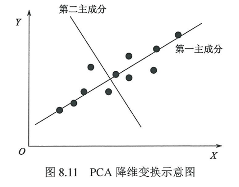

``` python
def pca_reduction(X: np.ndarray, retain_ratio: float = 0.95) -> Tuple[np.ndarray, np.ndarray]:
    """
    主成分分析降维
    :param X: 输入特征矩阵 (n_samples, n_features)
    :param retain_ratio: 保留的信息量比例 (默认0.95)
    :return: 降维后特征矩阵 Y (n_samples, d)，变换矩阵 W (d, n_features)
    """
```

**算法实现步骤**：

- 数据中心化，减去每个特征的均值，使数据零均值化

- 计算协方差矩阵

  $R=XX^T$

- 对协方差矩阵特征值分解

  同时将特征值从大到小排序，特征向量也相应排序

- 计算累积信息量比例，找到满足保留比例的最小维度

  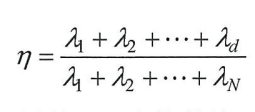

- 选取前 d个特征值对应的特征向量构建映射矩阵 $W$，将中心化数据投影到主成分空间
  $$
  Y=W^TX
  $$

##### UDP降维

无监督鉴别投影(unsupervised discriminated projection,UDP)是一种基于投影追踪的无监督降维方法，该方法从有利于目标聚类的角度提出了非局部的构想，得到一个简单的特征降维准则，即最大化非局部散度与局部散度的比，有效地利用了样本的局部特性和整体特性实现对原始数据的降维。

``` python
def udp_reduction(X: np.ndarray, n_components: int, k_neighbors: int = 5) -> np.ndarray:
    """
    无监督鉴别投影降维
    :param X: 输入特征矩阵 (n_samples, n_features)
    :param n_components: 输出维数
    :param k_neighbors: 近邻数
    :return: 降维后特征矩阵 Y (n_samples, n_components)
    """
```

1. **算法实现步骤**：

   - 构建邻接矩阵 H

     使用KNN找到每个样本的k个近邻，$H_{ij}=1$ 表示 $x_i$ 和 $x_j$ 互为近邻

   - 计算局部散度矩阵 $S_L$与非局部散度矩阵 $S_N$

     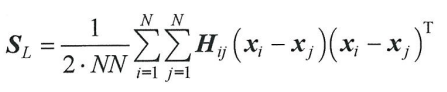

     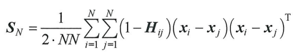

   - 求解广义特征值问题

     - 求解 $S_N W = \lambda S_L W$

     - 取最大的 $n_{components}$ 个特征值对应的特征向量

     - 这样可以最大化准则函数 $J(W) = \frac{W^T S_N W}{W^T S_L W}$，$J_N(W)$与$J_L(W)$分别为局部散度与非局部散度，此处省略，实际也不需计算这个

       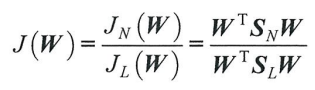

   - 数据投影降维，$Y=XW$

#### 特征选择

特征选择是从原始特征中筛选出满足某种准则的若干维特征的过程。与基于特征变换的降维方法类似，按照特征样本是否具备标签，可分为有监督特征选择和无监督特征选择两种。相对于特征变换而言，特征选择对应的降维映射矩阵中的元素仅由0和1组成，因此通过特征选择的方式降维之后并不会产生新的特征，而是在**原始特征向量中进行筛选**。

##### Fisher得分特征选择

``` python
def fisher_score_selection(X: np.ndarray, labels: np.ndarray, top_k: int) -> List[int]:
    """
    基于Fisher得分的特征选择
    :param X: 输入特征矩阵 (n_samples, n_features)
    :param labels: 样本标签 (n_samples,)
    :param top_k: 选择的特征个数
    :return: 选中的特征索引列表
    """
```

1. **算法实现步骤**：

   - 计算类间离散度 $S_b(f_i)$与类内离散度 $S_w(f_i)$

     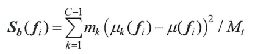

     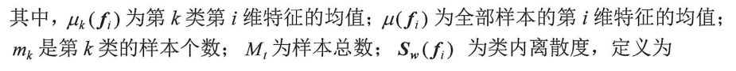

     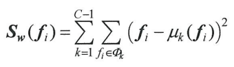

   - 计算Fisher鉴别率

     对某一特征$f_i$，其Fisher鉴别率定义为$J(f_i) = S_b(f_i) / S_w(f_i)$

   - 特征排序与选择，按Fisher鉴别率降序排序，选择前top_k个特征

2. **备注**：

   - 适用于多维特征间相关性不强的场合
   - 对非线性关系不敏感

##### 拉普拉斯得分特征选择

基于拉普拉斯分值的特征选择算法以拉普拉斯特征映射(Laplacian eigenmaps)和局部保持投影(locality preserving projection) 为基础，根据每一维特征值的分布、范围和该维特征上样本点与其近邻点的权重，为每一维特征计算对应的拉普拉斯得分。该得分反映了特征对数据集的局部保存能力，即反映了数据的局部分布情况。

``` python
def laplacian_score_selection(X: np.ndarray, top_k: int, sigma: float = 1.0) -> List[int]:
    """
    基于拉普拉斯得分的无监督特征选择
    :param X: 输入特征矩阵
    :param top_k: 选择的特征个数
    :param sigma: 高斯核参数
    :return: 选中的特征索引列表
    """
```

1. **算法实现步骤**：

   - 构造k近邻图，使用欧氏距离寻找每个样本的k个最近邻

   - 计算相似矩阵 S，其元素定义为：其中t为可调参数（代码中为sigma参数）

     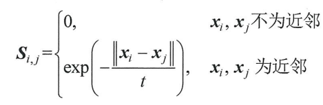

   - 构造拉普拉斯矩阵

     计算度矩阵 $D$（对角矩阵），构造拉普拉斯矩阵 $L = D - S$，$D_{ii} = \sum_j S_{ij}$

     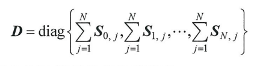

   - 计算拉普拉斯得分，对每一维特征 $f_r$ 计算得分

     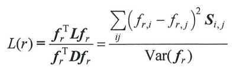

     分子：$f_r^T L f_r = \sum_{ij} (f_{r,i} - f_{r,j})^2 S_{ij}$

     分母：$f_r^T D f_r$ 与方差成正比

   - 特征排序与选择，按拉普拉斯得分升序排列，选择得分最低的前top_k个特征

     得分低表示特征在局部保持能力强的同时方差大

2. **备注**：

   - 得分低意味着：近邻点特征值接近（分子小）且整体方差大（分母大）

     特征的分布方差越大，局部相似度越高，则其拉普拉斯得分越低，特征则越重要。

##### MCFS特征选择

这里介绍一种多类别的无监督特征选择(multi-clusterfeature selection，MCFS)算法，该算法首先通过流形学习的方法将原始特征映射到特定的低维空间，然后通过回归学习的方法对原始数据进行误差拟合，得到相应的回归系数矩阵，该矩阵中的元素反映了原始数据空间中各维特征对新特征空间的贡献值。因此，在特征选择算法中，可以利用回归系数作为特征重要程度的判据，选取回归系数矩阵中前d个最大元素对应的特征作为特征选择的结果。

``` python
def mcfs_selection(X: np.ndarray, n_clusters: int, top_k: int, sigma: float = 1.0,
                   gamma: float = 1.0, max_iter: int = 1000) -> List[int]:
    """
    基于多聚类特征选择（MCFS）的无监督特征选择
    :param X: 输入特征矩阵 (n_samples, n_features)
    :param n_clusters: 聚类数（低维流形维数）
    :param top_k: 选择的特征个数
    :param sigma: 高斯核参数 (默认1.0)
    :param gamma: L1正则化参数 (默认1.0)
    :param max_iter: 最大迭代次数
    :return: 选中的特征索引列表
    """
```

1. **算法实现步骤**：

   - 构造相似矩阵 S，使用高斯核函数计算样本间相似度，矩阵元素如下

     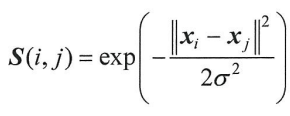

   - 提取最小特征值对应的特征向量

     求解相似矩阵的特征值分解，取前 `n_clusters` 个最小特征值对应的特征向量

   - 求解稀疏回归系数

     对每个特征向量求解Lasso回归问题，即下式，目标：用原始特征线性组合逼近特征向量

     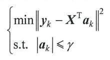

   - 计算特征权重并选择，下式为权重计算方法

     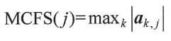

     即对每个特征，取其在所有回归系数中的最大绝对值，选择权重最大的前top_k个特征

